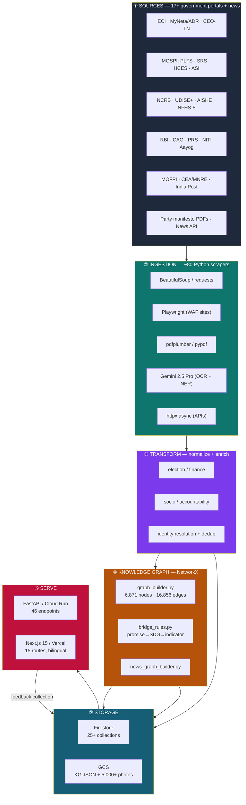
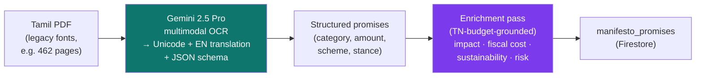
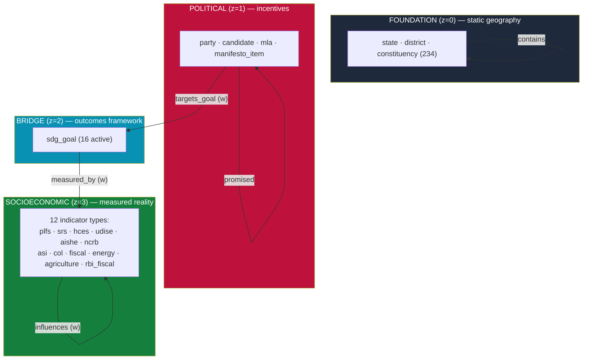
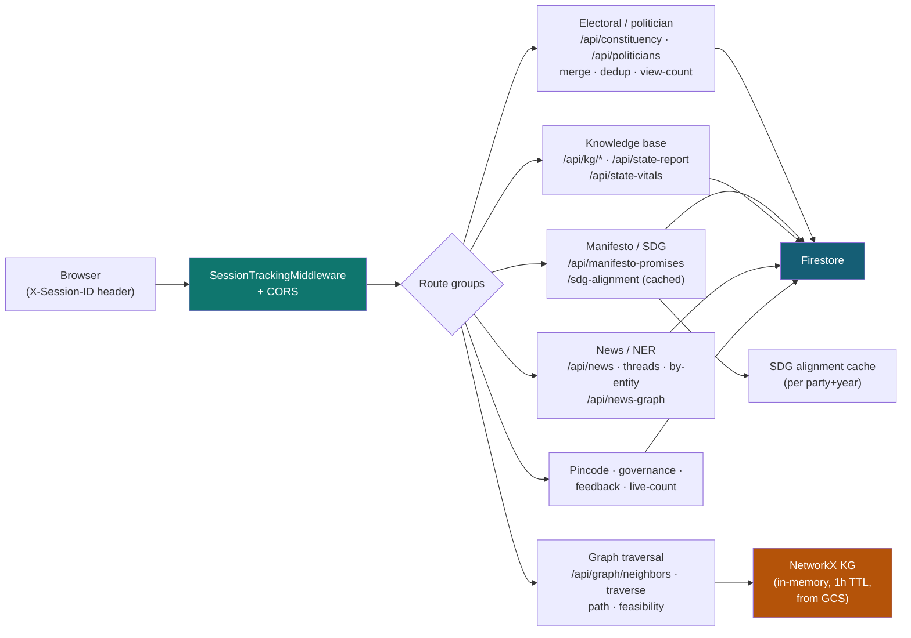
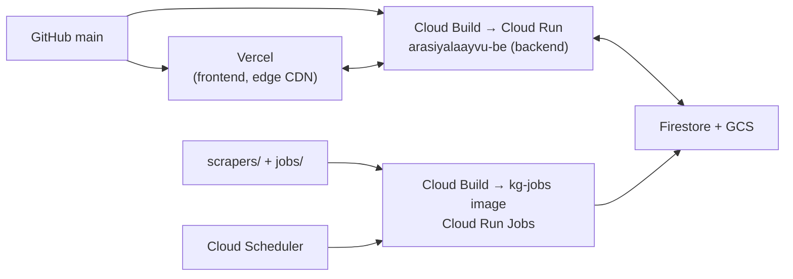
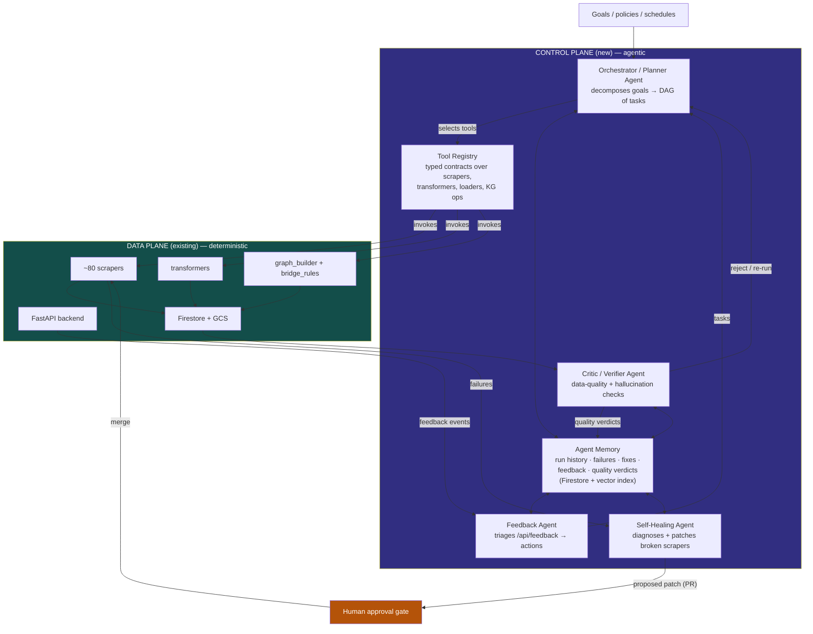
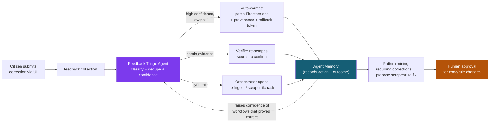
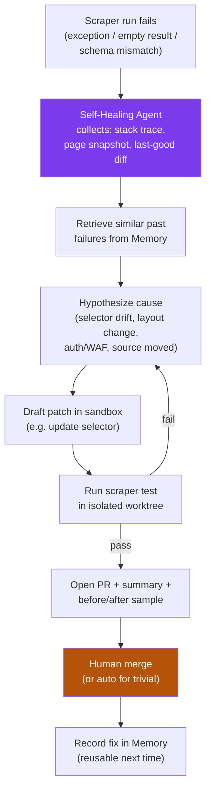
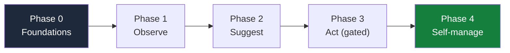

# ArasiyalAayvu — System Architecture

> **அரசியல்ஆய்வு** = *arasiyal* (politics) + *aayvu* (research)
> An open-source political-intelligence platform for Tamil Nadu. It ingests public government data, normalizes it, links it into a knowledge graph, and serves citizen-facing insights through a bilingual (EN / தமிழ்) web app.

This document describes the system as it is built **today**, layer by layer, and then lays out a concrete roadmap for evolving it into a **self-managing, autonomous agentic platform** that can learn from feedback, correct its own mistakes, plan, and deploy the agents it needs with minimal human intervention.

The document has two halves:

1. **Part I — Current Architecture** (what exists now, accurately mapped from the code)
2. **Part II — Agentic Architecture** (the target state and a migration path to get there)

---

## Part I — Current Architecture

### 1. The 30,000-foot view

ArasiyalAayvu is a classic **ETL → Store → Serve** pipeline with an AI-assisted extraction stage and a graph-based semantic layer. Data flows in one direction: from messy government sources, through cleaning and graph-building, into Firestore + GCS, and out to citizens via a FastAPI backend and a Next.js frontend.

**GCP project:** `naatunadappu` · **Region:** `asia-south1` · **Frontend:** Vercel · **Backend & jobs:** Cloud Run.

---

### 2. Layer ① + ② — Sources & Ingestion

#### 2.1 Orchestration entry point — `main.py`

`main.py` is a **CLI-driven task orchestrator**, not a long-running service. It is invoked as `python main.py --task <name>` and each task is a self-contained `scrape → transform → load` pipeline.

| Task | What it runs | Output collections |
|---|---|---|
| `all` | Full political-history pipeline | `assembly_elections`, `alliances`, `political_parties`, `leaders`, `chief_ministers`, `achievements` |
| `scrape` | CEO-TN, ECI recognition, Assembly CMs → `data/raw/` | (local JSON) |
| `transform` | Election records + alliance matrix → `data/processed/` | (local JSON) |
| `upload` | Static + elections → Firestore | (above collections) |
| `finance` | PRS PDF → debt / departmental spend → upload | `state_finances`, `debt_history`, `departmental_spending` |
| `socio` | ASER fetch + curated merge → upload | `socio_economics` |
| `accountability` | MyNeta scrape → enrich → party rollups | `candidate_accountability`, `party_accountability` |
| `awareness` | `socio` + `accountability` in sequence | (combined) |
| `manifesto` | Seed manifesto upload | `manifesto_promises` |

There is **no built-in scheduler** in `main.py` — orchestration is pull-based and triggered externally (developer CLI, or Cloud Run Jobs + Cloud Scheduler for the recurring jobs below).

#### 2.2 The scraper fleet (~80 files in `scrapers/`)

Scrapers share a common pattern: fetch → parse → optionally cache to `data/raw/` → transform → batch-write to Firestore (`merge=True`, 400-doc chunks, `_uploaded_at` + `_schema_version` metadata stamped on every doc).

**Source-type → tooling map:**

| Source type | Tooling | Resilience mechanism |
|---|---|---|
| Web HTML | `requests` + `BeautifulSoup` | `tenacity` retry + **curated in-code fallback** when govt sites fail |
| WAF-protected (ECI 2026) | **Playwright** (non-headless, dodges Akamai) | `.eci_candidates_progress.json` checkpoint for resume |
| PDF tables | `pdfplumber` / `pypdf` / `pdfminer.six` | SHA-256 checksum caching |
| Legacy-font Tamil PDFs | **Gemini 2.5 Pro multimodal** (reads PDF as images, bypasses font encoding) | 3-attempt retry, JSON-schema-enforced output |
| REST APIs (news) | `httpx` + `asyncio` | concurrency semaphores, Jaccard dedup before write |

**Functional grouping of scrapers:**

- **Election / candidate** — `eci_scraper`, `ceo_tn_scraper`, `eci_candidates_ingest`, `myneta_scraper`, `results_ingest`, `candidates_2026_ingest`
- **Manifesto / policy** — `manifesto_ocr_gemini`, `manifesto_enrich_gemini`, `manifesto_deep_enrich`
- **Socio-economic** — `aser_scraper`, `nfhs5_district_ingest`, `aishe_ingest`, `udise_ingest`, `niti_sdg_ingest`, `plfs_ingest`, `srs_ingest`, `hces_ingest`
- **Finance** — `prs_scraper`, `tn_budget_scraper`, `mlacds_budget_ingest`, `rbi_state_finances_ingest`, `state_budget_ingest`
- **News & KG** — `news_ingestion`, `news_graph_builder`, `news_backfill`, `ai_news_reader`
- **Geo / pincode** — `pincode_scraper`, `pincode_ingest`, `pincode_firestore_sync`, `gemini_constituency_pincode_ingest`, `ward_mapping_ingest`
- **Profiles / transparency** — `politician_profile_migrate`, `mla_profiles_ingest`, `adr_assets_ingest`, `adr_criminal_ingest`, `candidate_transparency_ingest`, `scrape_politician_photos`, `cache_candidate_photos`
- **Crime / safety** — `ncrb_ingest`, `district_crime_ingest`, `district_road_safety_ingest`
- **Utilities / maintenance** — `name_utils`, `ts_utils`, `dedup_candidates_2026`, `normalize_politician_names`, `merge_results`, `verify_all`

#### 2.3 The AI extraction sub-pipeline (manifestos)

Tamil manifestos ship as PDFs in legacy non-Unicode fonts (Bamini/TSCII); naive text extraction returns garbled bytes and earlier attempts hallucinated content. The current pipeline routes the PDF **as images** through Gemini 2.5 Pro:

The enrichment prompt is grounded with TN reference data (population, BPL count, MGNREGS wage, FY budget) and an explicit "data unavailable — cannot calculate" rule to suppress hallucination.

#### 2.4 Scheduled jobs (`scrapers/jobs/` → Cloud Run Jobs + Cloud Scheduler)

| Job | Cadence (IST) | Action |
|---|---|---|
| `fuel-refresh` | Monthly, 1st 01:00 | LPG/petrol/diesel → new `cost_of_living_india` snapshot |
| `col-refresh` | 6-monthly (1 Apr, 1 Oct) | Aavin dairy; flags PDS/transport for manual check |
| `sdg-check` | Annual (1 Jul) | Checks for new NITI SDG CSV; ingests if found, else prints a manual reminder |
| `news-reader-refresh` | Twice daily (06:00, 18:00) | Builds EN+TA TTS broadcast → `gs://naatunadappu-media/news-reader/` |

All four are packaged into one image (`gcr.io/naatunadappu/kg-jobs`, built via `cloudbuild-jobs.yaml`) and triggered by Cloud Scheduler HTTP calls. **This is the closest thing the system currently has to autonomy** — and notice `sdg-check` already exhibits a primitive "act if data exists, else ask a human" decision.

---

### 3. Layer ③ — Transformation

Four transformers convert raw scraped JSON into Firestore-ready, analysis-ready documents.

| Transformer | Input | Core logic | Output |
|---|---|---|---|
| `accountability_transformer.py` | MyNeta/ADR records | Criminal-severity banding (`CLEAN`/`MINOR`/`MODERATE`/`SERIOUS`), education tiering, `is_crorepati`, net-assets calc, constituency slugs | `candidate_accountability` + per-party rollups + `tn_assembly_2021_summary` |
| `election_transformer.py` | CEO-TN results | Party-name → canonical ID, vote-share %, 118/234 majority logic, 1952–2021 alliance matrix | `elections` |
| `finance_transformer.py` | PRS budget parse | `interest_as_pct_revenue`, `committed_as_pct_revenue`, `discretionary_revenue_cr`, debt-to-GSDP, curated "why debt rose" notes | `state_finances`, `debt_history`, `departmental_spending` |
| `socio_transformer.py` | ASER + NFHS-5 | Merge fresh ASER into curated base, 3-year trend tracking (2018→2022→2024) | `socio_economics` |

**Identity resolution** is a distinct, important concern handled across `politician_profile_migrate.py` + `normalize_politician_names.py`: a strict 3-rule dedup (same name+initials, same constituency, same gender) collapses 5,000+ raw candidate rows into person-level `politician_profile` documents — the **single source of truth**, with a `constituency_mla_index` reverse index for fast lookup.

---

### 4. Layer ④ — Knowledge Graph

#### 4.1 What it is (and isn't)

The graph is a **deterministic, rule-based policy-accountability graph** built with NetworkX. **It is not (yet) GraphRAG** — there are no embeddings, no vector store, and no LLM retrieval over the graph. Edges are constructed from expert-curated rules, not learned. (This gap is a primary target of Part II.)

#### 4.2 Ontology — 4 layers

`scrapers/knowledge_graph/ontology.json` defines a layered DAG:

**Edge verbs (16):** structural (`contains`, `belongs_to`, `operates_in`), political (`contests`, `represents`, `promised`, `allied_with`, `won`), policy-to-outcome (`targets_goal`, `measured_by`), causal (`influences`), contextual (`describes`).

#### 4.3 Bridge rules — the analytical core (`bridge_rules.py`)

Three curated mapping tables turn promises into measurable accountability:

1. **`MANIFESTO_CATEGORY_TO_SDG`** — e.g. `education → SDG 4 (1.0)`, `employment → SDG 8 (1.0) + SDG 1 (0.7)`.
2. **`SDG_TO_INDICATORS`** — each SDG → 2–6 indicators with weights (1.0 primary, 0.7 strong, 0.4 indirect, 0.2 contextual). e.g. SDG 1 → `hces.mpce_combined (1.0)`, `plfs.unemployment (0.7)`.
3. **`INDICATOR_INFLUENCES`** — 11 expert-defined causal links with sign + magnitude, e.g. `plfs.unemployment →[+0.6]→ ncrb.crime`, `aishe.ger →[−0.4]→ plfs.unemployment` (lagged).

#### 4.4 Build & persistence

`graph_builder.py` runs an ordered build (`foundation → sdg nodes → indicators → political → alliances → won-seats → operates-in → sdg bridge → causal links`), computes a deterministic `spring_layout` (`k=2.5, iterations=150, seed=42`) so node positions are stable in the UI, then serializes to:

- `data/processed/knowledge_graph.json` (full, ~3 MB)
- `data/processed/knowledge_graph_slim.json` (API-optimized)
- uploaded to `gs://naatunadappu-media/knowledge_graph/latest.json` and mirrored to a Firestore `knowledge_graph/latest` doc.

`news_graph_builder.py` builds a **separate** graph from NER-enriched `news_articles` (11 node types: Person, Party, Institution, Policy, Place, Event, Industry, Resource, Community, SDG, Topic), accumulating edge weight per co-mention.

---

### 5. Layer ⑤ — Storage

| Store | Contents |
|---|---|
| **Firestore** (`naatunadappu`) | 25+ collections: `politician_profile`, `constituency_mla_index`, `candidate_accountability(_2026)`, `candidates_2026`, `manifesto_promises`, `socio_economics`, `district_{crime,health,water_risk,road_safety}`, indicator collections (`plfs`, `srs`, `hces`, `aishe`, `udise`, `ncrb`, `asi`, `energy_stats`, `mofpi`, `rbi_state_finances`, `sdg_index`, `cost_of_living`), `state_finances`, `state_budgets`, `election_results_2026`, `news_articles`, `pincode_mapping`, `ward_mapping`, `ulb_councillors`, `district_collectors`, `feedback`, `usage_counters`, `meta/presence/*` |
| **GCS** (`naatunadappu-media`) | KG JSON (`knowledge_graph/latest.json`), news KG, 5,000+ candidate photos (immutable, 1-yr cache), news-reader TTS audio |

Indicator collections use a **time-series subcollection pattern**: `{collection}/{entity_slug}/snapshots/{period}`.

---

### 6. Layer ⑥ — Serving

#### 6.1 Backend — FastAPI on Cloud Run (`web/backend_api/`)

46 endpoints, grouped:

Notable runtime behaviors:

- **KG load:** `graph_query.load_graph()` pulls the slim JSON from GCS into an `nx.MultiDiGraph`, cached 1h, refreshable via `POST /api/graph/cache/clear`. Traversal primitives: `neighbors()` (1-hop, verb-filtered), `traverse()` (BFS, `max_depth`/`max_nodes`), `shortest_path()`.
- **Feasibility scoring** (`/api/graph/feasibility/{promise_id}`): walks `promise → targets_goal → sdg → measured_by → indicator`, cross-joins fiscal snapshots, returns a 0–100 score banded High/Moderate/Stretched/Low.
- **SDG alignment** (`sdg_alignment.py`): per `(party, year)`, scores each promise with depth × coverage × risk × root-cause multipliers × KG edge weight; cached indefinitely, invalidated on manifesto edit.
- **Session tracking:** `X-Session-ID` piggybacks on every call; a daemon flushes active counts to `meta/presence/instances/{id}` once/min; `/api/live-count` aggregates across instances (30s cache).
- **Feedback intake:** `POST /api/feedback` stores `{category, message, user_agent, client_ip, page_url, entity_context, status:"new"}` for moderation. **Today this is a dead-end queue — nothing consumes it.** (Part II makes it the spine of the learning loop.)

#### 6.2 Frontend — Next.js 15 on Vercel (`web/src/`)

15 App-Router routes (`/`, `/constituency/[slug]`, `/manifesto-tracker`, `/party-history`, `/state-report/[slug]`, `/sdg-tracker`, `/knowledge-graph`, `/politicians`, `/news`, `/pincode-map`, `/2026_results`, `/hung-assembly`, `/law-the-indian-constitution`, `/spending`).

Client infrastructure: `api-client.ts` (typed `apiGet`, injects session ID), `data-cache.ts` (URL-keyed in-memory + consent-gated localStorage, midnight TTL, idle prefetch of 12 endpoints), `LanguageContext.tsx` (EN↔தமிழ், persisted), `CookieConsentContext.tsx` (GDPR-style gating).

> ⚠️ **Note:** the **root-level `/src`** appears to be legacy from a pre-monorepo layout; the **canonical, deployed app is `/web/src`**. This should be confirmed and removed to avoid confusion.

#### 6.3 Deployment topology

---

### 7. Honest assessment — where autonomy is missing today

| Capability | Current state | Gap |
|---|---|---|
| **Data freshness** | 4 scheduled jobs; everything else is manual CLI | No autonomous detection of *when* a source has new data |
| **Error recovery** | `tenacity` retries + curated fallbacks | No memory of failures, no root-cause diagnosis, no self-repair of a broken scraper |
| **Quality control** | `verify_all.py` (manual), "data unavailable" prompt rule | No continuous validation, no anomaly detection on ingested values |
| **Feedback** | `feedback` collection collects, `sdg-check` asks human | Feedback is never read back into the pipeline; no learning |
| **Planning** | Hardcoded task order in `main.py` / build order in `graph_builder.py` | No dynamic planning of what to run, when, or in what order |
| **Retrieval** | Graph traversal + curated bridge rules | No semantic/embedding retrieval; bridge rules are static and hand-maintained |
| **Schema** | `schemas/__init__.py` is empty; schemas inline per scraper | No contract enforcement → silent drift |

These gaps define the work in Part II.

---

## Part II — Agentic Architecture (target state)

> **Goal (from the project owner):** evolve ArasiyalAayvu so it can *learn from feedback, correct mistakes, plan, and deploy the agents it needs to manage itself with minimal human intervention.*

The strategy is **not** to bolt an LLM onto the side. It is to add a thin **control plane** above the existing data plane (your scrapers, transformers, graph, API) that observes, decides, and acts — while keeping every consequential action auditable and (initially) human-approvable. The existing pipeline becomes the set of **tools** the agents operate.

### 8. Design principles

1. **Agents orchestrate; deterministic code executes.** Scrapers/transformers stay deterministic and testable. Agents decide *which* to run, *when*, and *how to react* to results. This keeps cost, reproducibility, and debuggability under control.
2. **Everything is a tool with a typed contract.** Wrap each scraper/transformer/loader as a callable tool with an explicit input/output schema (this finally gives `schemas/` a job).
3. **Close the loop through the graph.** Feedback, run outcomes, and data-quality verdicts become *first-class nodes and edges* — the system reasons over its own operating history the same way it reasons over politics.
4. **Graduated autonomy.** Start in *suggest* mode (agent proposes, human approves), promote proven workflows to *auto-with-rollback*, reserve *full-auto* for low-risk, well-bounded tasks. A trust/confidence score per workflow governs promotion.
5. **Every action is logged, attributable, and reversible.** Idempotent `merge=True` writes already help; add per-run provenance and snapshot/rollback.

### 9. Target topology — the control plane

### 10. The agent roster

A small, specialized fleet is more reliable than one monolithic agent. Each has a narrow charter, its own tools, and writes to shared memory.

| Agent | Charter | Key tools it calls | Autonomy tier (target) |
|---|---|---|---|
| **Orchestrator / Planner** | Turn a high-level goal ("refresh all socio data before the next SDG release") into an ordered task DAG; dispatch; track. | Tool Registry, Scheduler, Memory | Auto for scheduling; suggest for novel plans |
| **Source Watcher** | Detect when a source has *new* data (page hash diff, "last updated" fields, RSS, CSV presence) and emit a refresh task. Generalizes today's `sdg-check`. | HTTP probes, checksums, Memory | Full-auto (read-only detection) |
| **Ingestion Runner** | Execute a scraper tool, capture structured run outcome (rows, duration, errors). | Scraper tools | Auto-with-rollback |
| **Critic / Verifier** | Validate freshly ingested data: schema conformance, range/anomaly checks, cross-source consistency, manifesto hallucination checks. Block promotion of bad data. | Validation tools, prior snapshots, LLM judge | Full-auto to *reject*; suggest to *accept-anomaly* |
| **Self-Healing** | When a scraper breaks (selector drift, layout change), diagnose from the error + page diff, draft a code patch, open a PR, run tests. | Code-edit tools, sandbox runner, git/PR | Suggest (PR + human merge) → auto for trivial fixes |
| **Feedback Triage** | Read `feedback` collection, classify (correction / missing-data / bug), de-dupe, route to a task or a graph correction; reply-status. | Firestore, Memory, Orchestrator | Suggest → auto for high-confidence corrections |
| **Bridge-Rule Learner** | Propose new/updated `bridge_rules` edges and weights from observed indicator correlations + literature, with citations. Keeps the analytical core fresh. | Stats over snapshots, web research, Memory | Suggest only (high-stakes, always human-reviewed) |
| **Graph Retrieval (RAG)** | Serve semantic + graph-hybrid retrieval to all other agents and to a future citizen-facing Q&A. | Vector index, KG traversal | Full-auto (read-only) |

### 11. Closing the feedback loop (the heart of the request)

Today feedback dies in a Firestore collection. The target makes it a learning signal:

The key idea: **repeated corrections of the same kind become evidence that a scraper or bridge rule is wrong**, automatically promoting a fix proposal — that is "learning from feedback" with a human still gating code changes.

### 12. Agent Memory — so the system actually *learns*

Add a memory substrate the agents read and write. Two parts:

- **Episodic / operational** (Firestore): one document per run — `{tool, args, started_at, status, rows_written, errors, verdict, rollback_token, triggered_by}`. This is the audit log *and* the training signal for "what usually goes wrong."
- **Semantic** (vector index — e.g. Vertex AI Vector Search or pgvector): embeddings of source pages, error traces, feedback text, and prior fixes, so an agent facing a new failure can retrieve "how was a similar break fixed before?"

This memory is also what finally makes the knowledge graph a true **GraphRAG**: index node/edge text + documents, and let retrieval combine vector similarity with graph traversal. A citizen could then ask *"which DMK promises target youth unemployment and how is that indicator trending?"* and get a grounded, cited answer.

### 13. Self-healing scrapers

The highest-leverage agentic capability for a scraper-heavy system. When a scraper fails:

### 14. Guardrails — non-negotiable for a *political* platform

Autonomy on politically sensitive data demands strict controls:

- **Human-in-the-loop gates** on: any code/rule change, any auto-correction above a risk threshold, anything touching candidate criminal/asset claims.
- **Provenance on every datum** — which agent/run/source produced it, when, with what confidence; surfaced in the UI's existing feedback/disclaimer ethos.
- **Reversibility** — snapshot before agentic writes; one-click rollback via stored tokens.
- **Hallucination firewall** — the Verifier must confirm LLM-extracted facts (esp. manifestos) against source text before promotion; keep the existing "data unavailable — cannot calculate" discipline as a hard rule.
- **Cost & rate budgets** per agent run; circuit-breakers on runaway loops.
- **Non-partisanship checks** — the Critic flags any agent output that reads as editorializing rather than reporting.

### 15. Migration roadmap (incremental, low-risk)

**Phase 0 — Foundations (no agents yet).**
Make the data plane agent-ready. Fill `schemas/` with Pydantic contracts for every scraper output. Wrap each scraper/transformer/loader as a registered tool with typed I/O. Add per-run provenance + a run-outcome log to Firestore. Add snapshot/rollback to the loader. *Outcome: deterministic pipeline becomes a clean tool library.*

**Phase 1 — Observe.**
Ship the **Source Watcher** (generalize `sdg-check` into change-detection across all sources) and the **Critic/Verifier** in *report-only* mode (it scores data quality but doesn't block). Stand up Agent Memory (episodic log + first vector index). *Outcome: the system knows when sources change and when data looks wrong — still tells a human.*

**Phase 2 — Suggest.**
Add the **Orchestrator/Planner** and **Feedback Triage**, both proposing actions a human approves in a simple review queue. Bring the **Graph Retrieval/GraphRAG** layer online for internal use. *Outcome: the system proposes refreshes, fixes, and corrections; human clicks approve.*

**Phase 3 — Act (gated).**
Promote proven workflows to *auto-with-rollback*: Source Watcher → auto-trigger ingestion; Verifier → auto-reject bad data; Feedback Triage → auto-apply high-confidence corrections. Ship **Self-Healing** in PR-only mode. *Outcome: routine operations run themselves; risky ones still gated.*

**Phase 4 — Self-manage.**
Confidence-scored promotion lets the Orchestrator plan and run end-to-end refresh cycles, deploy/scale Cloud Run Jobs as needed, and let Self-Healing auto-merge trivial fixes. The **Bridge-Rule Learner** continuously proposes analytical improvements (always human-reviewed). *Outcome: minimal-intervention operation; humans set goals and review high-stakes changes.*

### 16. What to build first (concrete next steps)

1. **Populate `schemas/`** with Pydantic models for the top ~10 highest-churn scrapers; have them validate on write.
2. **Add a `runs` collection + provenance fields** stamped by a thin wrapper around the loader (you already stamp `_uploaded_at`/`_schema_version` — extend this).
3. **Build the Tool Registry** — a single module that lists each scraper/transformer/loader with its input/output schema and a uniform `run(args)` interface.
4. **Generalize `jobs/sdg_check.py`** into a config-driven Source Watcher across all sources.
5. **Write a Feedback Triage worker** that finally reads the `feedback` collection — start by just classifying and routing to a human review queue.
6. **Stand up the vector index** over KG nodes + manifesto text to convert the graph into GraphRAG and power a cited Q&A endpoint.

Each step delivers value on its own and is a prerequisite for the agent that follows — so the platform becomes progressively more autonomous without a risky big-bang rewrite.

---

*Document generated from a full read of the codebase (`main.py`, `scrapers/`, `transformers/`, `scrapers/knowledge_graph/`, `web/backend_api/`, `web/src/`, jobs, and build configs). Diagrams use Mermaid and render on GitHub. Part I reflects the system as built; Part II is a proposed direction, not yet implemented.*
